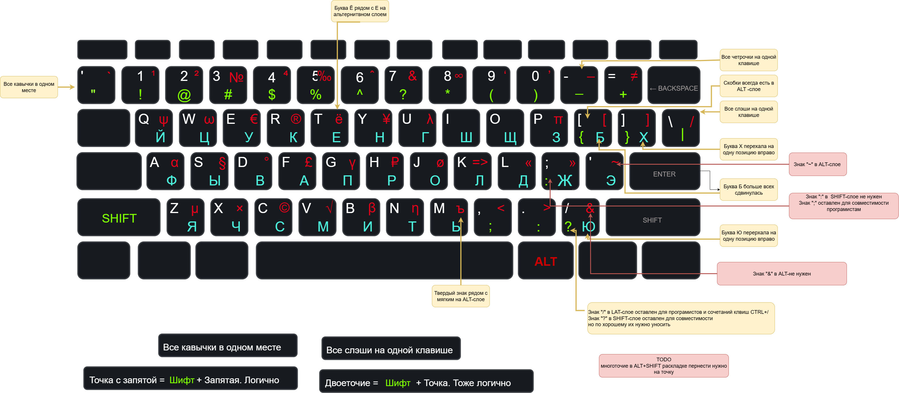

# ZH-SK-keymap
Это описание моей раскладки для стандартной клавиатуры.

Сделано на основе раскладки двух раскладок "Никиты Широкова" 
[link](https://github.com/braindefender/universal-layout) и "Никиты Прокопова" [link](https://github.com/tonsky/Universal-Layout)
От Никиты Широкова взята идея с расположением на одних клавишах похожих запятых, кавычек, слешей.
От Прокопова расположение букв "Б", "Х" а также цифр на своих местах.
Вернее, я сначала поставил раскладку "Никиты Широкова", и в течении месяца поставил буквы и цыфры как у Прокопова. А когда начал описывать получившуюся раскладку, то внимательно прочитал как это было сделано у Прокопова. 
И понял, что я пришел к тому же самому. Удивительно но "№" я поставил туда же.

